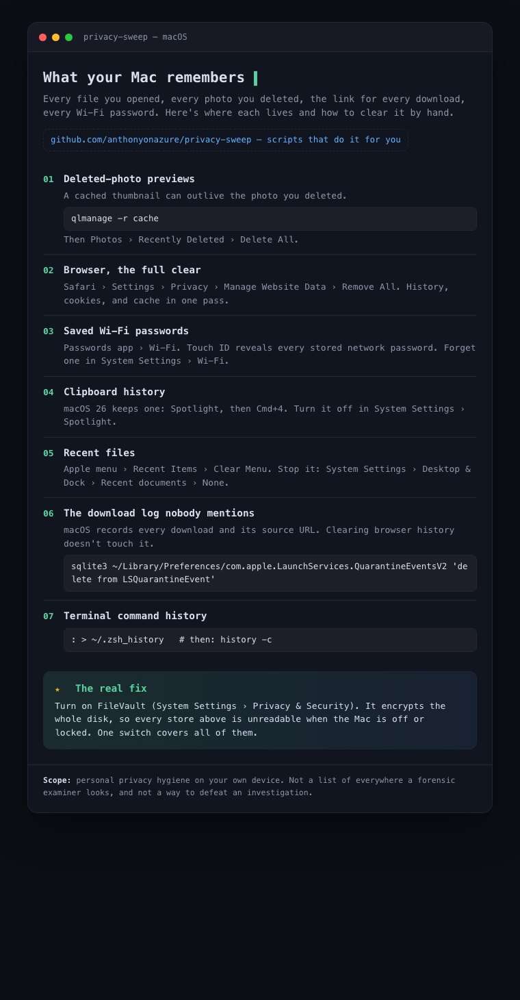

# privacy-sweep

Your computer keeps a surprising amount of history about you: thumbnails of photos you deleted, a
log of every program you ran, lists of files you opened, networks you joined, and things you copied.
Operating systems keep these caches to make everything load faster. The side effect is that the
records survive long after you delete the original file, and most "cleaner" apps only touch a
fraction of them.

**privacy-sweep** is a set of small, readable scripts that clear those stores on your **own**
device. One folder per operating system, one standalone script per store, so you can run just the
one you want or the whole set.

<p align="center">
  
</p>

Screenshot-ready visual cards, one per platform:
[/Users/anthony/Projects/privacy-sweep/assets/macos.png](assets/macos.png) ·
[/Users/anthony/Projects/privacy-sweep/assets/ios.png](assets/ios.png) ·
[/Users/anthony/Projects/privacy-sweep/assets/android.png](assets/android.png)
(source HTML lives in [/Users/anthony/Projects/privacy-sweep/threads](threads/)).

## What this is for

Everyday privacy hygiene: before you sell or donate a machine, after using a shared computer, or
just to keep your data footprint small. This is the same category of tool as
[BleachBit](https://www.bleachbit.org/) and the built-in Windows Disk Cleanup, packaged so you can
see exactly what each script does before you run it.

**Use it only on devices you own or are authorized to administer.** Don't use it to destroy records
you have a legal duty to keep, or on machines that aren't yours.

## Quick start: one command for your OS

There's a top-level launcher that detects your operating system and runs the right full sweep:

```bash
./privacy-sweep.sh --dry-run   # macOS or Linux: preview, delete nothing
./privacy-sweep.sh             # ask before each step
```

```powershell
.\privacy-sweep.ps1 -DryRun    # Windows (run Terminal as Administrator): preview
```

Or go into a platform folder and run a single store's script on its own. Please read
[/Users/anthony/Projects/privacy-sweep/SECURITY.md](SECURITY.md) first: it's short, and it draws the
line between privacy hygiene (fine) and destroying records you have a duty to keep (not fine).

## How the scripts behave

Every script follows the same three-mode pattern so nothing is deleted by surprise:

| How you run it | What happens |
| --- | --- |
| `./clear-something.sh --dry-run` | Lists exactly what it would clear and how big it is. Deletes nothing. **Start here.** |
| `./clear-something.sh` | Shows the targets, then asks `Proceed? [y/N]` before deleting anything. |
| `./clear-something.sh --yes` | Skips the prompt and clears immediately. For automation and the `clear-all` runner. |

Every script prints what it did. None of them touch anything needed to boot or run the OS, and none
of them require `sudo` unless the folder README says so explicitly.

## Platforms

| Folder | Status | Notes |
| --- | --- | --- |
| [/Users/anthony/Projects/privacy-sweep/macos](macos/) | Scripts | Bash. Tested on macOS 26. |
| [/Users/anthony/Projects/privacy-sweep/windows](windows/) | Scripts | PowerShell. Run in an elevated terminal for Prefetch. |
| [/Users/anthony/Projects/privacy-sweep/linux](linux/) | Scripts | Bash. Works on GNOME/KDE desktops. |
| [/Users/anthony/Projects/privacy-sweep/ios](ios/) | Guide | iOS is sandboxed and encrypted; no script can reach these. Manual steps only. |
| [/Users/anthony/Projects/privacy-sweep/android](android/) | Guide + partial | Some clearing possible over `adb`; most is manual. |

## The real fix: encryption at rest

Chasing every cache by hand never fully wins, because the system rewrites them as you work. The one
control that covers the entire list at once is **full-disk encryption**: FileVault on macOS,
BitLocker on Windows, LUKS on Linux, and the on-by-default encryption on modern iOS and Android.
When the device is off or locked, every one of these stores is unreadable without your password.
These scripts reduce what a *logged-in* session leaves lying around; encryption protects the disk
itself.

## License

MIT. See [/Users/anthony/Projects/privacy-sweep/LICENSE](LICENSE). No warranty. You are responsible
for what you delete.
